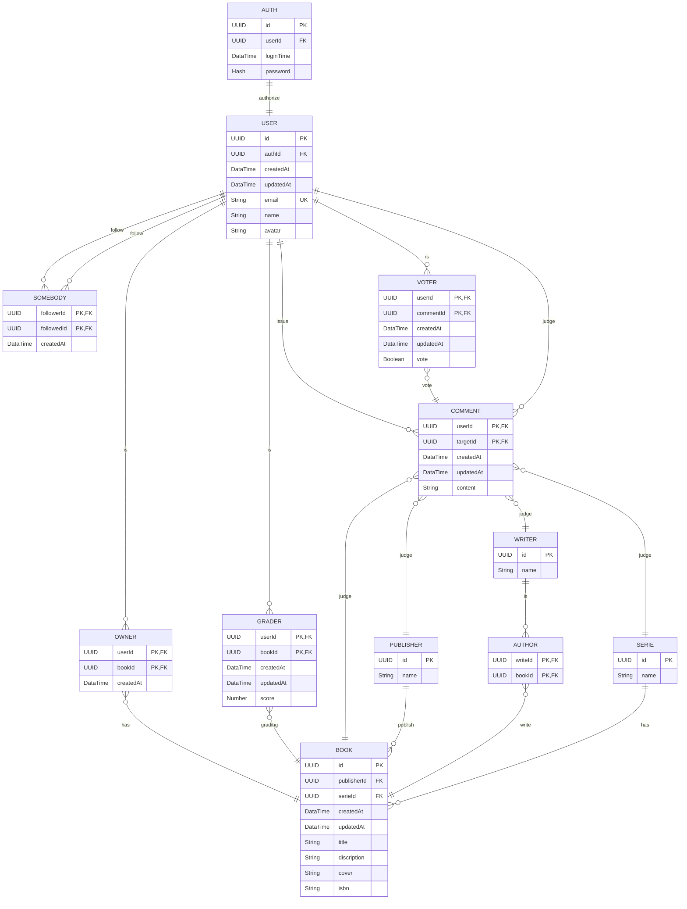

# Database

This is the database package. It is responsible for the database connection and the schema definition.

We use [Prisma](https://www.prisma.io) as an ORM. It is a very powerful tool that allows us to define our schema in a declarative way and generate the database client for us. The generated client will be exported from this package and used in the other packages of the monorepo.

## Entity Relationship Diagrams

## License

The code in this project is released under the [MIT License](./LICENSE).
